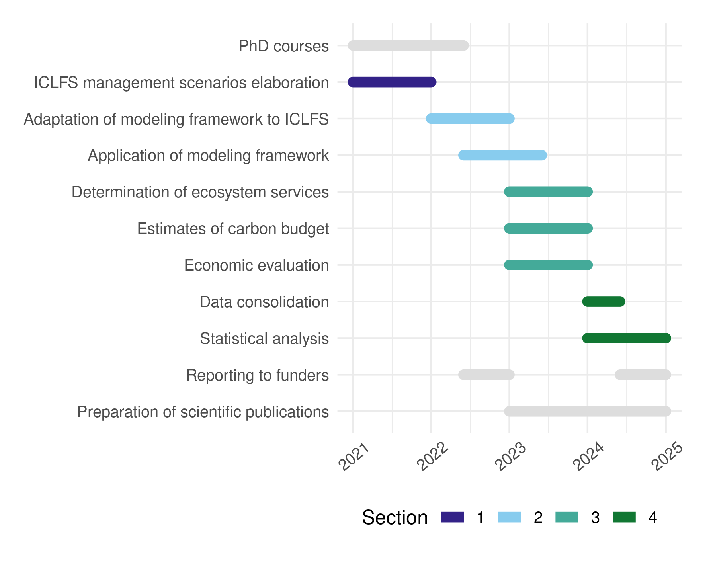

# timeliner

This is a simple routine that reads a .csv file with research
tasks and their start and end dates, and plots a beautiful
research time line. 

Each individual task should have a unique
id, and you can group your tasks into sections, which will
be plotted in different colors, using a colorblind safe
palette. The palette is composed of 9 colors, if you exceed
this number of sections, consider reducing it or increasing
the number of colors of the palette. If you don't want 
colors, you can set all section values to NA.

This is an example of the .csv file to be read by the script.

| id 	| activity                                  	| start      	| end        	| section 	|
|----	|-------------------------------------------	|------------	|------------	|---------	|
| 1  	| PhD courses                               	| 01-01-2021 	| 01-06-2022 	| NA      	|
| 2  	| ICLFS management scenarios elaboration    	| 01-01-2021 	| 01-01-2022 	| 1       	|
| 3  	| Adaptation of modeling framework to ICLFS 	| 01-01-2022 	| 01-01-2023 	| 2       	|
| 4  	| Application of modeling framework         	| 01-06-2022 	| 01-06-2023 	| 2       	|
| 5  	| Determination of ecosystem services       	| 01-01-2023 	| 01-01-2024 	| 3       	|
| 6  	| Estimates of carbon budget                	| 01-01-2023 	| 01-01-2024 	| 3       	|
| 7  	| Economic evaluation                       	| 01-01-2023 	| 01-01-2024 	| 3       	|
| 8  	| Data consolidation                        	| 01-01-2024 	| 01-06-2024 	| 4       	|
| 9  	| Statistical analysis                      	| 01-01-2024 	| 01-01-2025 	| 4       	|
| 10 	| Reporting to funders                      	| 01-06-2022 	| 01-01-2023 	| NA      	|
| 11 	| Reporting to funders                      	| 01-06-2024 	| 01-01-2025 	| NA      	|
| 12 	| Preparation of scientific publications    	| 01-01-2023 	| 01-01-2025 	| NA      	|

The columns of the .csv file should be extatly like the table above. The **id** column must be a unique number for each task. The **activity** is a string (it should not be too long, to avoid that most of the plot being occupied by the text). The **start** and **end** columns shoul be filled with dates following the format DD-MM-YYYY. The **section** column can be filled with numbers or characters, since the routine reads it as a factor, the NA values will be plotted as gray segments.

This is the resulting plot:

